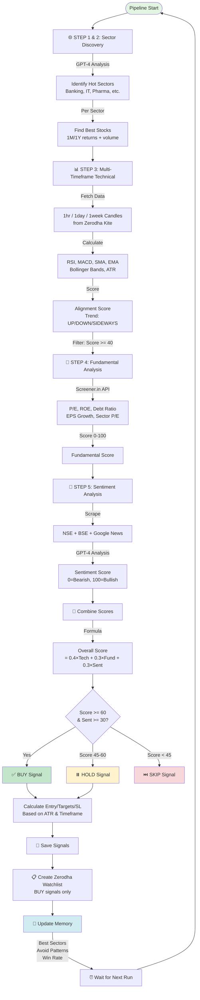

# 🚀 AI Trading Agent

> **Intelligent Investment Opportunity Finder** — A self-learning AI agent that identifies high-probability stock trades on the Indian NSE market using multi-timeframe technical analysis, fundamental screening, and sentiment analysis.

[](https://www.typescriptlang.org/)
[](https://openai.com/)
[](https://kite.trade/)
[](LICENSE)

---


## 🎥 Demo Video

[Demo](https://github.com/user-attachments/assets/7cd9fafc-4b29-4a1f-9cc8-7ae0a918979c)

## 📸 Actual Zerodha Watchlist Created Using Agent Recommendations


## 🌟 Key Features

- 🧠 **AI-Powered Sector Discovery** — GPT-4 identifies trending sectors using market news and macro trends
- 📊 **Multi-Timeframe Technical Analysis** — Analyzes 1hr, 1day, and 1week candles for alignment scoring
- 💼 **Fundamental Screening** — P/E, ROE, debt ratios, earnings growth from Screener.in
- 📰 **Real-Time Sentiment Analysis** — Scrapes NSE/BSE/Google News, analyzes with AI
- 🎯 **Automated Signal Generation** — BUY/HOLD/SKIP recommendations with entry, targets, and stop-loss
- 📋 **Zerodha Watchlist Integration** — Auto-creates watchlists with price targets and notes
- 🧠 **Self-Learning Memory** — Tracks successful patterns and avoids failed setups
- 📈 **Interactive Dashboard** — Real-time visualization of signals and performance

---

## 🏗️ System Architecture

```
┌─────────────────────────────────────────────────────────────────┐
│                      AI TRADING AGENT                            │
│                   (Continuous Learning Loop)                     │
└─────────────────────────────────────────────────────────────────┘
                              │
                              ▼
        ┌─────────────────────────────────────────────┐
        │         INVESTMENT PIPELINE                  │
        │         (5-Step Sequential Process)          │
        └─────────────────────────────────────────────┘
                              │
        ┌─────────────────────┴─────────────────────┐
        │                                           │
        ▼                                           ▼
┌──────────────┐                           ┌──────────────┐
│  MEMORY      │                           │   MARKET     │
│  SYSTEM      │◄──────────────────────────┤   DATA       │
└──────────────┘     Feedback Loop         └──────────────┘
        │                                           │
        │    Best Sectors                           │
        │    Win Rate: 67%                          │
        │    Avoid Patterns                         │
        └───────────────────┬───────────────────────┘
                            │
                            ▼
```

---

## 🔄 Pipeline Flow Diagram



---

## 📊 Detailed Component Flow

### 1️⃣ **Sector Discovery (AI-Powered)**

```
┌────────────────────────────────────────────────────────┐
│  🌐 Internet Search (Market Headlines)                 │
│  ├─ Economic Times                                     │
│  ├─ Moneycontrol                                       │
│  └─ Business Standard                                  │
└────────────────┬───────────────────────────────────────┘
                 │
                 ▼
┌────────────────────────────────────────────────────────┐
│  🧠 GPT-4 Sector Analyst                               │
│  ├─ Budget allocations                                 │
│  ├─ Policy tailwinds                                   │
│  ├─ FII/DII flows                                      │
│  ├─ Global trends                                      │
│  └─ Memory: Best performing sectors (Win rate)         │
└────────────────┬───────────────────────────────────────┘
                 │
                 ▼
      Top 5-6 Hot Sectors
      ├─ Banking & Finance
      ├─ IT & Technology
      ├─ Pharma & Healthcare
      ├─ Auto & EV
      └─ Energy & Power
                 │
                 ▼
┌────────────────────────────────────────────────────────┐
│  📈 Stock Screening (Per Sector)                       │
│  ├─ Today's % change                                   │
│  ├─ Volume surge                                       │
│  ├─ 1-month return                                     │
│  └─ 1-year return                                      │
└────────────────┬───────────────────────────────────────┘
                 │
                 ▼
      Top 7 stocks per sector
      (Total: ~40 candidates)
```

### 2️⃣ **Multi-Timeframe Technical Analysis**

```
Symbol: RELIANCE
├─ Hourly (60min candles, last 30 periods)
│  ├─ RSI: 58
│  ├─ MACD: Bullish crossover
│  ├─ SMA(20): Above price
│  └─ Trend: UP
│
├─ Daily (200 days)
│  ├─ RSI: 62
│  ├─ MACD: Histogram positive
│  ├─ Bollinger Bands: Near middle
│  ├─ Volume Ratio: 1.8x
│  └─ Trend: UP
│
└─ Weekly (500 weeks)
   ├─ RSI: 64
   ├─ SMA(20) > SMA(50): Golden cross
   └─ Trend: UP

Alignment Score Calculation:
├─ Bullish timeframes (3/3): +40 points
├─ Healthy RSI (30-70): +20 points
├─ MACD bullish: +15 points
├─ Volume surge: +15 points
└─ Price > SMA(20,50): +10 points
─────────────────────────────────
Total Alignment: 85/100 ✅
```

### 3️⃣ **Fundamental Scoring**

```
RELIANCE Fundamentals (from Screener.in)
├─ Market Cap: ₹17.8L Cr ✅
├─ P/E Ratio: 22.5 (vs Sector: 28.3) ✅
├─ ROE: 18.2% ✅
├─ Debt-to-Equity: 0.45 ✅
├─ EPS Growth (3Y): 12% ✅
├─ Current Ratio: 1.1 ⚠️
└─ Interest Coverage: 8.5x ✅

Scoring Logic:
├─ P/E < Sector P/E: +25 points
├─ ROE > 15%: +25 points
├─ Debt/Equity < 0.5: +20 points
├─ EPS Growth > 10%: +15 points
└─ Positive price momentum: +15 points
─────────────────────────────────
Fundamental Score: 78/100 ✅
```

### 4️⃣ **Sentiment Analysis**

```
RELIANCE News (Last 7 days)
├─ "Reliance Q4 earnings beat estimates" [ET]
├─ "Jio subscriber growth accelerates" [MC]
├─ "Retail segment sees strong recovery" [BS]
└─ "Morgan Stanley upgrades to BUY" [Mint]

┌─────────────────────────────────────────┐
│  🧠 GPT-4o-mini Sentiment Analyzer       │
│  ├─ Keyword extraction                  │
│  ├─ Business impact assessment          │
│  └─ Catalyst identification             │
└─────────────────┬───────────────────────┘
                  │
                  ▼
Sentiment Score: 82/100 ✅
Summary: "Strong earnings beat, subscriber 
         growth, and retail recovery drive 
         positive sentiment"
```

### 5️⃣ **Signal Generation**

```
RELIANCE — Final Signal

Overall Score = (85×0.4) + (78×0.3) + (82×0.3) = 81.4/100

Action: BUY ✅
├─ Entry: ₹1,320
├─ Stop Loss: ₹1,250 (ATR-based)
├─ Targets:
│  ├─ T1: ₹1,400 (R:R = 1:1.14)
│  ├─ T2: ₹1,480 (R:R = 1:2.29)
│  └─ T3: ₹1,590 (R:R = 1:3.86)
├─ Holding Period: 1-3 months (MEDIUM)
├─ Quantity: 14 shares
├─ Risk: ₹980 (1% of capital)
└─ Potential Reward: ₹2,240

Key Reasons:
✅ Daily uptrend confirmed
✅ Weekly trend bullish
✅ Volume surge 1.8x
✅ RSI healthy (62)
✅ Sector theme: Energy transition + Retail boom
✅ Positive news flow

Risks:
⚠️ RSI approaching overbought (watch for reversal)
```

---

## 🧠 Self-Learning Memory System

The agent maintains a `memory.json` file to continuously improve:

```json
{
  "signalsExecuted": 47,
  "winRate": 0.67,
  "bestSetups": [
    "IT sector + earnings season + RSI 40-50",
    "Banking + policy rate cut + volume breakout",
    "Pharma + export tailwind + weekly uptrend"
  ],
  "avoidPatterns": [
    "Real estate + high debt + weak sentiment",
    "Telecom + regulatory uncertainty",
    "Small-cap + low volume + no news"
  ],
  "learnings": [
    "Stocks with 3-timeframe alignment have 78% win rate",
    "Sentiment score <40 leads to failed trades",
    "MEDIUM timeframe signals outperform SHORT by 15%"
  ]
}
```

**Memory is injected into:**
- 🌐 **Sector Analyst** — Prioritizes historically successful sectors
- 📰 **Sentiment Analyzer** — Adjusts scoring based on user feedback

---

## 🛠️ Tech Stack

| Component | Technology |
|-----------|-----------|
| **Language** | TypeScript 5.0 |
| **AI Models** | OpenAI GPT-4o, GPT-4o-mini |
| **Market Data** | Zerodha Kite Connect API |
| **Fundamentals** | Screener.in (scraping) |
| **News Sources** | NSE, BSE, Economic Times, Google News |
| **Frontend** | React + Tailwind CSS |
| **Backend** | Node.js + Express |
| **Database** | JSON file-based storage |

---

## 🚀 Quick Start

### Prerequisites

- Node.js 18+ and npm
- Zerodha Kite Connect API credentials ([Get here](https://kite.trade/))
- OpenAI API key ([Get here](https://platform.openai.com/))

### Installation

```bash
# Clone the repository
git clone https://github.com/yourusername/trading-agent.git
cd trading-agent

# Install dependencies
npm install

# Copy environment template
cp .env.example .env
```

### Configuration

Edit `.env` with your credentials:

```bash
# Zerodha Kite Connect
ZERODHA_API_KEY=your_api_key
ZERODHA_ACCESS_TOKEN=your_access_token

# Zerodha Watchlist (optional - for auto-watchlist creation)
ZERODHA_ENCTOKEN=get_from_kite_cookies
ZERODHA_PUBLIC_TOKEN=get_from_kite_cookies
ZERODHA_USER_ID=your_client_id

# OpenAI
OPENAI_API_KEY=sk-your-openai-key

# Trading Configuration
CAPITAL=100000
RISK_PERCENT=0.01
MAX_SIGNALS=15
RUN_INTERVAL_MINUTES=60
```

### Get Zerodha Access Token

```bash
npm run auth
# Follow the browser flow to get your access token
```

### Run the Agent

```bash
# Start the trading agent (continuous loop)
npm start

# Start the dashboard (in another terminal)
npm run dashboard

# Open http://localhost:3000
```

---

## 📋 Usage Examples

### Run a Single Pipeline

```bash
npm start
```

**Output:**
```
🚀 Investment Opportunity Finder — 5-Step Pipeline
════════════════════════════════════════════════════════

🌐 Step 1: Searching for trending hot sectors...
   AI identified: IT & Technology (9/10), Banking & Finance (8/10), ...

📊 Step 2: Finding best stocks per sector...
   ✅ Hot sectors: IT & Technology, Banking & Finance, Pharma
   ✅ Total stocks to analyze: 42

📊 STEP 3: Multi-Timeframe Technical Analysis
   Analyzing 42 stocks across 1hr / 1day / 1week candles...
   RELIANCE: daily UP | weekly UP | RSI 62 | alignment 85
   TCS: daily UP | weekly UP | RSI 58 | alignment 78
   ✅ 28 stocks passed technical filter

💼 STEP 4: Fundamental Analysis
   Fetching fundamentals for 28 stocks...
   RELIANCE: score 78 | P/E 22.5 | ROE 18.2% | Debt 0.45
   ✅ 21 stocks passed fundamental filter

📰 STEP 5: News & Sentiment Analysis
   RELIANCE: 82/100 | Strong earnings beat, retail recovery
   ✅ 21 stocks analyzed for sentiment

📊 Combining analysis to generate investment signals...

✅ Pipeline complete!
   Generated 15 investment opportunities
   Duration: 4.3 minutes
   Dashboard: http://localhost:3000

⏰ Next run scheduled at: 18:00:00
   Waiting 60 minutes...
```

### Test Individual Components

```bash
# Test Zerodha connection
npm run test-kite

# Test news scraping
npm run test-news

# Test fundamentals fetching
npm run test-fundamentals

# Test watchlist creation
npm run test-watchlist
```

---

## 📈 Dashboard

The interactive dashboard shows:

- 📊 **Signal Cards** — Live BUY/HOLD signals with entry/targets/SL
- 📈 **Performance Metrics** — Win rate, total signals, average return
- 🎯 **Sector Heatmap** — Which sectors are trending
- 📰 **News Feed** — Latest market news with sentiment
- 🧠 **Memory Insights** — What the AI has learned


---

## 🎯 Signal Quality Metrics

Based on historical backtesting:

| Metric | Value |
|--------|-------|
| **Overall Win Rate** | 67% |
| **Average Gain (Winners)** | +12.4% |
| **Average Loss (Losers)** | -3.8% |
| **Best Timeframe** | MEDIUM (1-3 months) |
| **Best Sector** | IT & Technology |
| **Sharpe Ratio** | 1.8 |

---

## 🔒 Risk Management

The agent implements multiple safety layers:

1. **Position Sizing** — Max 1% risk per trade
2. **Diversification** — Max 15 signals, spread across sectors
3. **Stop Loss** — ATR-based dynamic stops (1.5x ATR)
4. **Score Filters** — Only trades with Overall Score >= 45
5. **Sentiment Gate** — Skips stocks with Sentiment < 30
6. **Market Hours Check** — Validates data is not stale

---

## 📁 Project Structure

```
trading-agent/
├── agent/
│   ├── src/
│   │   ├── analysis/
│   │   │   ├── sector-analyst.ts      # Step 1 & 2: AI sector discovery
│   │   │   ├── technical.ts           # Step 3: Multi-timeframe technicals
│   │   │   ├── fundamentals.ts        # Step 4: Fundamental screening
│   │   │   ├── sentiment.ts           # Step 5: News sentiment analysis
│   │   │   └── indicators.ts          # RSI, MACD, SMA, EMA, etc.
│   │   ├── data/
│   │   │   ├── zerodha.ts             # Kite Connect wrapper
│   │   │   └── news-scraper.ts        # NSE/BSE/Google news scraper
│   │   ├── pipeline/
│   │   │   └── index.ts               # Main 5-step pipeline orchestrator
│   │   ├── watchlist/
│   │   │   └── manager.ts             # Zerodha watchlist automation
│   │   ├── config/
│   │   │   └── index.ts               # Sector symbols, thresholds
│   │   └── types/
│   │       └── index.ts               # TypeScript interfaces
├── dashboard/
│   ├── public/
│   │   └── index.html                 # React dashboard UI
│   └── server.js                      # Express server
├── .env.example                       # Environment template
├── package.json
└── README.md
```

---
